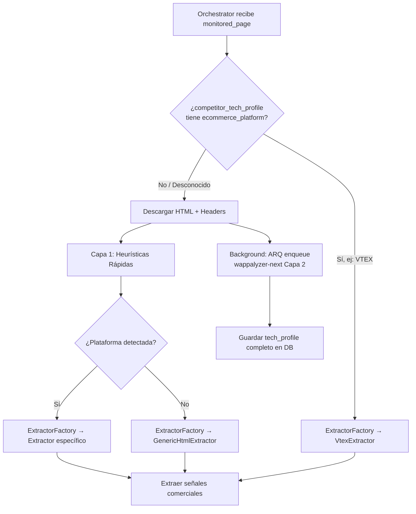

# Pluggable Extractors: Arquitectura Strategy Pattern

## 1. Problema
Cada plataforma de eCommerce estructura su HTML/JS/datos de forma radicalmente distinta. Un selector XPath genérico que funciona en VTEX se rompe en Shopify. Necesitamos **un extractor específico por plataforma** que se seleccione automáticamente.

## 2. Patrón: Strategy + Factory



## 3. Estructura de Carpetas

```
src/
└── workers/
    └── web_monitor/
        ├── __init__.py
        ├── orchestrator.py          # Job principal de ARQ
        ├── platform_detector.py     # Capa 1: heurísticas rápidas
        ├── extractor_factory.py     # Factory que enruta al extractor correcto
        └── extractors/
            ├── __init__.py
            ├── base.py              # ABC: BaseExtractor
            ├── vtex.py              # VtexExtractor
            ├── shopify.py           # ShopifyExtractor
            ├── magento.py           # MagentoExtractor
            ├── tiendanube.py        # TiendanubeExtractor
            ├── woocommerce.py       # WooCommerceExtractor
            ├── prestashop.py        # PrestashopExtractor
            └── generic_html.py      # GenericHtmlExtractor (fallback)
```

## 4. Flujo Detallado (Paso a Paso)

| Paso | Acción | Entrada | Salida |
|:---|:---|:---|:---|
| **A** | Consultar `competitor_tech_profile.ecommerce_platform` en DB | `competitor_id` | `platform: str \| None` |
| **B** | Si `platform` es conocida → ir a **E** | | |
| **C** | Si `platform` es `None` → descargar página (HTTPX) | `url` | `html: str`, `headers: dict` |
| **D** | Correr `PlatformDetector.detect()` (Capa 1 heurística) | `html`, `headers` | `EcommercePlatform` enum |
| **E** | `ExtractorFactory.create(platform)` → instancia concreta | `EcommercePlatform` | `BaseExtractor` |
| **F** | Ejecutar `extractor.extract_all()` | `html` | `list[DetectedSignal]` |
| **G** | (Background) Si pasamos por C/D, encolar `fingerprint_full_task` en ARQ | `competitor_id`, `html`, `headers` | Actualiza `competitor_tech_profile` |

## 5. Contratos (Interfaces)

### `BaseExtractor` (ABC)
```python
@abstractmethod
async def extract_promos(self, html: str) -> list[PromoSignal]

@abstractmethod
async def extract_financing(self, html: str) -> list[FinancingSignal]

@abstractmethod
async def extract_hero_banner(self, html: str) -> HeroBanner | None

@abstractmethod
async def extract_ctas(self, html: str) -> list[CallToAction]

async def extract_all(self, html: str) -> ExtractionResult:
    """Orquesta todos los sub-extractores y devuelve el resultado consolidado."""
```

### `PlatformDetector`
```python
@staticmethod
def detect(html: str, headers: dict[str, str]) -> EcommercePlatform:
    """Capa 1: heurísticas rápidas. Retorna UNKNOWN si no matchea."""
```

### `ExtractorFactory`
```python
@staticmethod
def create(platform: EcommercePlatform) -> BaseExtractor:
    """Devuelve la instancia del extractor correcto o GenericHtmlExtractor."""
```

## 6. Ventajas de esta Arquitectura
- **Agregar un nuevo competidor en TiendaNube** = crear `tiendanube.py` que hereda de `BaseExtractor`. Cero cambios en el orquestador.
- **Testeable unitariamente:** Cada extractor se testea con HTML crudo estático (fixture).
- **Resiliente:** Si un extractor específico falla, el Factory puede degradar a `GenericHtmlExtractor` en vez de romper toda la corrida.
