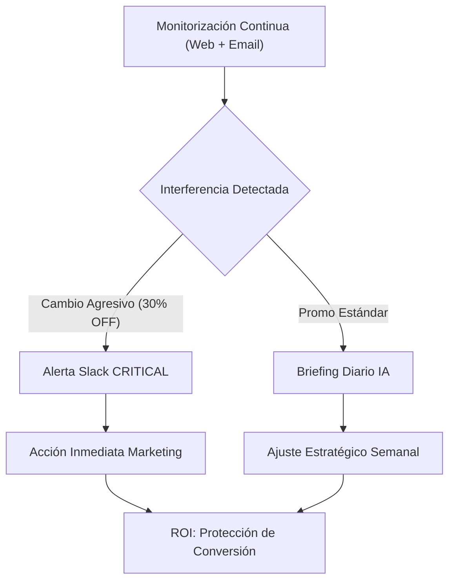
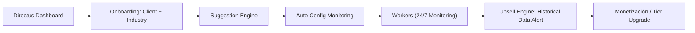
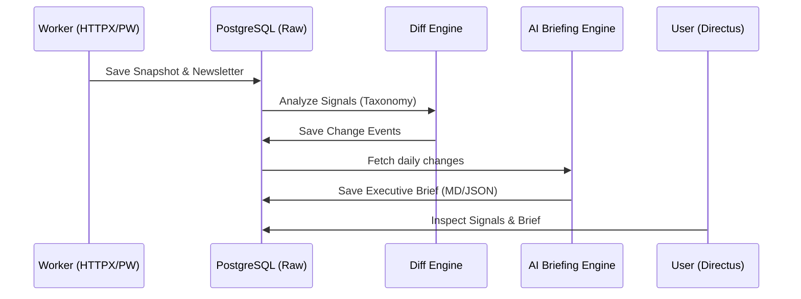

# Strategic Flows: Economic & Operational Vision

Estos diagramas representan cómo el sistema captura valor y cómo interactúan los distintos perfiles con la plataforma.

## 1. El Flujo del Cliente (Valor de Negocio)
Cómo un CMO o Gerente de eCommerce usa la herramienta para ganar mercado.

## 2. El Flujo del Owner (SaaS Operations)
Cómo gestionas el negocio y escalas la plataforma.

## 3. Arquitectura de Datos (CTO View)
Estructura de "Raw to Brief" para asegurar trazabilidad.

